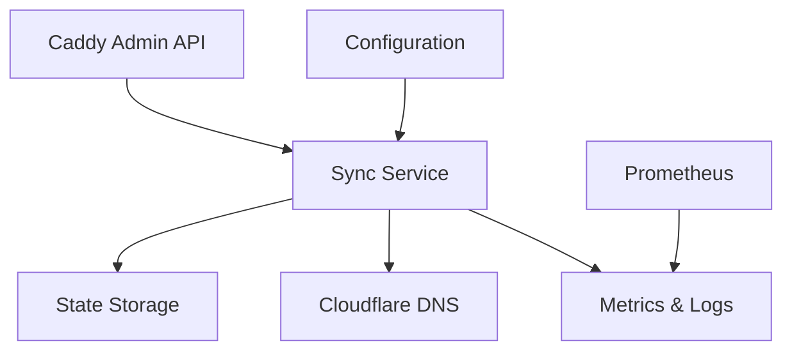

# Caddy DNS Synchronizer

## Purpose
Automatically synchronize reverse-proxy configurations from Caddy server with Cloudflare DNS records.

## Key Features
- Automatic A record management based on Caddy reverse proxy configs
- Dry-run mode for safe testing
- State persistence using BadgerDB
- Protected records safeguard
- Interval-based synchronization
- Multi-provider DNS support
- Automatic A/CNAME record detection with ownership TXT records
- Exponential backoff retry mechanism
- Zone validation to prevent misconfiguration
- Caddy API authentication support
- Comprehensive metrics for operational visibility

## Architecture Overview

## How It Works
1. Poll Caddy Admin API for reverse proxy configurations
2. Compare with persisted state
3. Calculate DNS changes needed
4. Apply changes to Cloudflare DNS (with safety checks and ownership verification)
5. Update persisted state
6. Expose operational metrics via Prometheus endpoint
