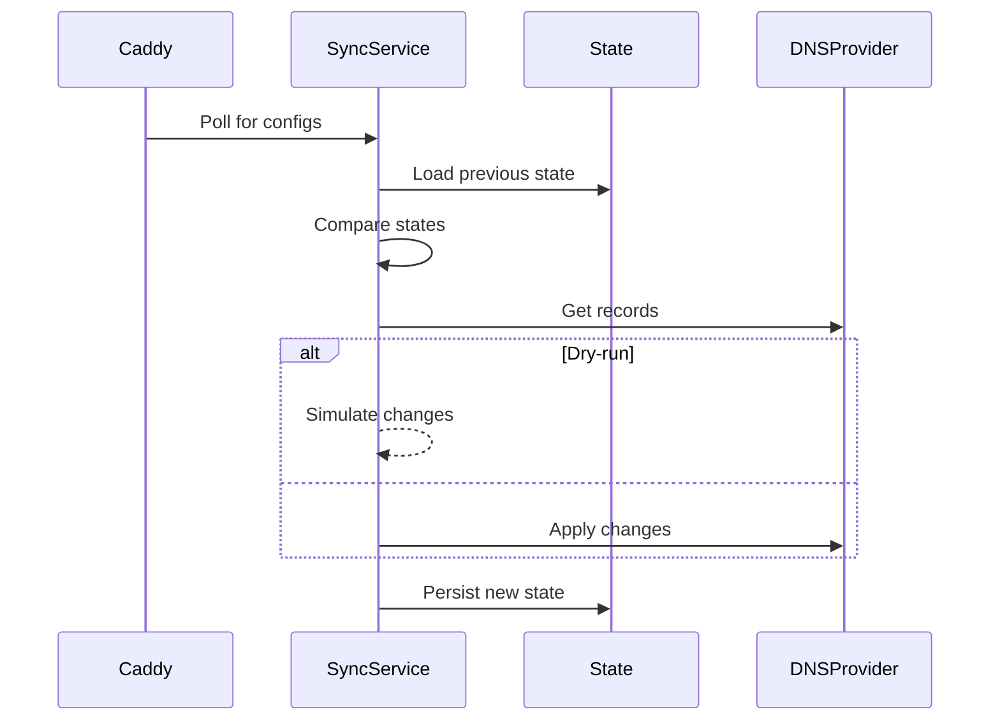

# Codebase Structure

## Package Overview
| Package      | Responsibility                          |
|--------------|-----------------------------------------|
| config       | Configuration loading & validation      |
| provider     | DNS provider implementations           |
| reconcile    | Change detection & planning            |
| source       | Caddy API integration                  |
| state        | Persisted state management             |

## Key Interfaces
```go
// DNS provider operations
type Provider interface {
    GetRecords(ctx context.Context, zone string) ([]Record, error)
    CreateRecord(ctx context.Context, zone string, record Record) error
    UpdateRecord(ctx context.Context, zone string, record Record) error 
    DeleteRecord(ctx context.Context, zone string, record Record) error
    ValidateZone(ctx context.Context, zone string) error
}

// Reconciliation engine
type Engine interface {
    Reconcile(ctx context.Context, domains []source.DomainConfig) (Results, error)
}

// Retry handler
type RetryPolicy interface {
    Execute(ctx context.Context, operation func() error) error
}
```

## Data Flow

