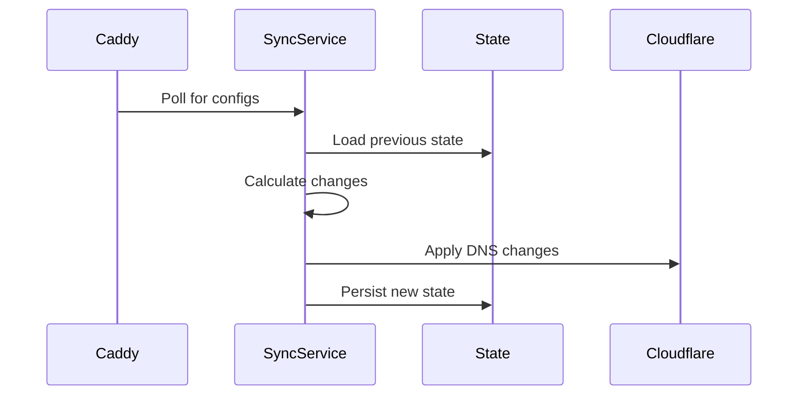

# Codebase Structure

## Package Overview
| Package      | Responsibility                          |
|--------------|-----------------------------------------|
| config       | Configuration loading & validation      |
| provider     | DNS provider implementations           |
| reconcile    | Change detection & planning            |
| source       | Caddy API integration                  |
| state        | Persisted state management             |

## Key Interfaces
```go
// DNS provider operations
type Provider interface {
    GetRecords(zone string) ([]Record, error)
    CreateRecord(zone string, record Record) error
    UpdateRecord(zone string, record Record) error 
    DeleteRecord(zone string, record Record) error
}

// Reconciliation engine
type Engine interface {
    Reconcile(domains []source.DomainConfig) (Results, error)
}
```

## Data Flow

